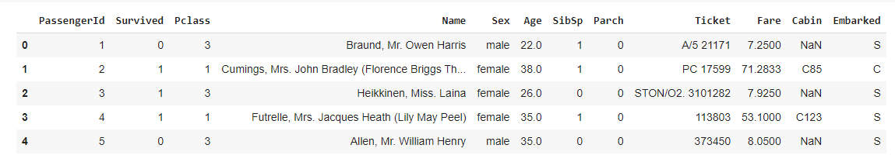
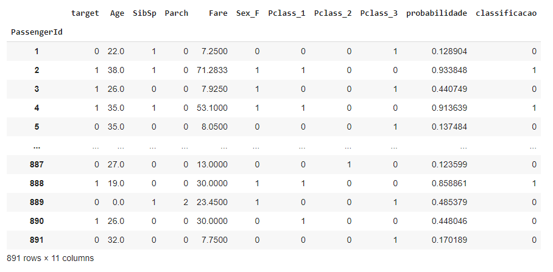

###### Data_Science_Data_Prediction_Pandas_Numpy_Python_Colab_Research_Google_Jupyter_Notebook
# Data Science Data Prediction Pandas Numpy Python Colab Research Google Jupyter Notebook

### Previsão de Sobrevivência do [RMS Titanic](https://www.google.com/search?q=titanic&source=hp&ei=GwgkYfqICaLZ5OUP9ouKuAI&iflsig=AINFCbYAAAAAYSQWK8W0lCxxC45t0s_CY4We7sIdfKN8&oq=titanic&gs_lcp=Cgdnd3Mtd2l6EAMyCwgAEIAEELEDEIMBMgsILhCABBCxAxCDATILCC4QgAQQsQMQgwEyCwgAEIAEELEDEIMBMgsIABCABBCxAxCDATILCAAQgAQQsQMQgwEyCwgAEIAEELEDEIMBMgsIABCABBCxAxCDATIICAAQgAQQsQMyBQgAEIAEOg4ILhCABBCxAxDHARCjAjoICAAQsQMQgwE6DgguEIAEELEDEMcBENEDOhEILhCABBCxAxDHARDRAxCTAjoFCC4QgAQ6CAguEIAEELEDOhEILhCABBCxAxCDARDHARDRAzoOCC4QsQMQgwEQxwEQ0QM6DggAEIAEELEDEIMBEMkDOgUIABCSAzoLCC4QsQMQxwEQrwFQvBNY5iZg-DVoA3AAeACAAZcBiAHVCJIBAzAuOZgBAKABAbABAA&sclient=gws-wiz&ved=0ahUKEwi6gsHlgMjyAhWiLLkGHfaFAicQ4dUDCAc&uact=5)

Apenas 31% dos que estavam a bordo sobreviveram a este desastre. O objetivo deste projeto é, criar um modelo que faz a previsão de sobrevivência com base numa tabela com dados de Tripulantes e Passageiros do RMS Titanic

### Dados
Dois arquivos cvs baixados de Kaggle http://www.kaggle.com/c/titanic-gettingStarted/data:

    train.csv (dados para um subconjunto de passageiros, incluindo resultados (sobreviveram ou morreram))
    test.csv (dados para um subconjunto de passageiros sem resultados)

### Descrição de dados:

<pre>
Survival - Sobrevivência (0 = Não; 1 = Sim). Não incluído no arquivo test.csv.
Pclass - Classe de passageiros (1 = 1ª; 2 = 2ª; 3 = 3ª)
Name - Nome
Sex - Sexo
Age - Idade
Sibsp - número de Irmãos / Cônjuges a bordo
Parch - número de Pais / Filhos a bordo
Ticket - Número do ingresso / Passagem
Fare - tarifa do passageiro
Cabin - Cabine
Embarked - Porto de Embarque (C = Cherbourg; Q = Queenstown; S = Southampton)
</pre>

### Tabelas

    Tabela de Treinamento (primeiras linhas)
        

 OBS.: O algorítmo de classificação determina como resultado da previsão que se a pessoa sobreviveu, recebe 1 (um) na classificação. Caso contrário, recebe 0 (zero) na classificação

    Tabela de Resultado (visão parcial)
        

outras fontes:

http://rstudio-pubs-static.s3.amazonaws.com/24969_894d890964fd4308ab537bfde1f784d2.html

